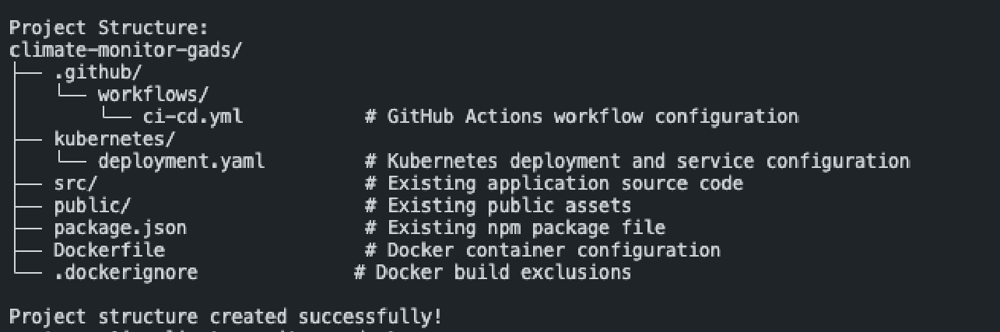
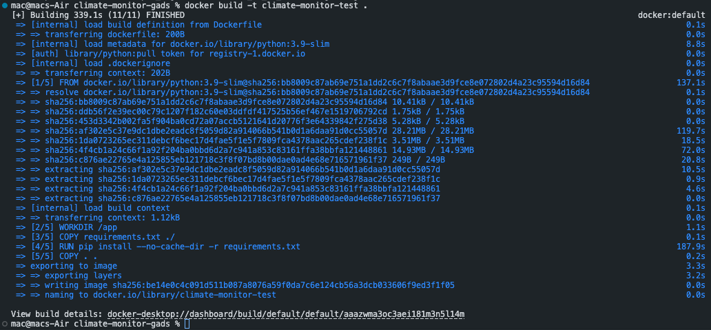
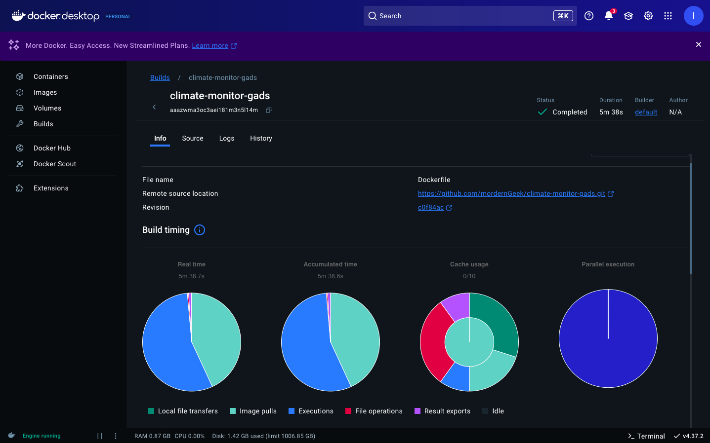
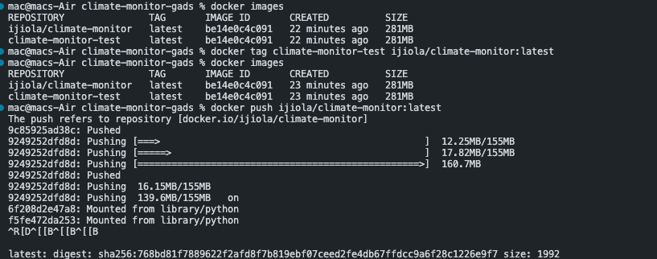

# Climate Monitor CI/CD Pipeline

A containerized CI/CD pipeline implementation for the Climate Monitor application, featuring automated testing, Docker containerization, and Kubernetes deployment configurations.

## Project Structure
```bash
climate-monitor-gads/
├── .github/
│   └── workflows/
│       └── ci-cd.yml           # GitHub Actions workflow configuration
├── kubernetes/
│   └── deployment.yaml         # Kubernetes deployment and service configuration
├── src/                        # Application source code
├── tests/                      # Test files
├── requirements.txt            # Python dependencies
├── Dockerfile                  # Docker container configuration
├── .dockerignore              # Docker build exclusions
└── README.md                   # Project documentation
```

## CI/CD Pipeline Workflow

1. **Continuous Integration**
   - Code push triggers GitHub Actions workflow
   - Python environment setup
   - Install dependencies
   - Run automated tests
   - Build Docker image

2. **Continuous Deployment**
   - Push Docker image to DockerHub
   - Update Kubernetes manifests
   - Ready for deployment to Kubernetes cluster

## Prerequisites

- Python 3.9+
- Docker
- DockerHub account
- GitHub account
- Kubernetes cluster (for deployment)

## Setup Instructions

### 1. Clone the Repository
```bash
git clone https://Stormz99/climate-monitor-gads.git
cd climate-monitor-gads
```

### 2. Project Structure Setup
Create the project structure using the provided script:

```bash
#!/bin/bash

# Create project structure script
echo "Creating Climate Monitor CI/CD Project Structure..."

# Create necessary directories
mkdir -p .github/workflows
mkdir -p kubernetes
mkdir -p src
mkdir -p tests

# Create required files
touch Dockerfile
touch .dockerignore
touch kubernetes/deployment.yaml
touch .github/workflows/ci-cd.yml
touch requirements.txt

echo "Project structure created successfully!"
```

Save this as `project_structure.sh` and run:
```bash
chmod +x project_structure.sh
./project_structure.sh
```

 



### 3. Configure Docker
```bash
# Build the image
docker build -t climate-monitor-test .

# Run locally
docker run -p 5000:5000 climate-monitor-test
```



### 4. DockerHub Setup
```bash
# Tag image
docker tag climate-monitor-test ijiola/climate-monitor:latest

# Push to DockerHub
docker push ijiola/climate-monitor:latest
```


g
### 5. GitHub Actions Setup

1. Add GitHub Secrets:
   - DOCKERHUB_USERNAME
   - DOCKERHUB_TOKEN

2. Push code to trigger workflow:
```bash
git add .
git commit -m "Initial CI/CD setup"
git push origin main
```

## Deployment

### Kubernetes Deployment
```bash
kubectl apply -f kubernetes/deployment.yaml
```

## Container Registry

The Docker image is available at:
```
docker pull ijiola/climate-monitor:latest
```

## Additional Resources

- [GitHub Actions Documentation](https://docs.github.com/en/actions)
- [Docker Documentation](https://docs.docker.com/)
- [Kubernetes Documentation](https://kubernetes.io/docs/)

## Contact

Ijiola - [GitHub Profile](https://github.com/ijiola)

Project Link: [https://github.com/ijiola/climate-monitor-gads](https://github.com/ijiola/climate-monitor-gads)
